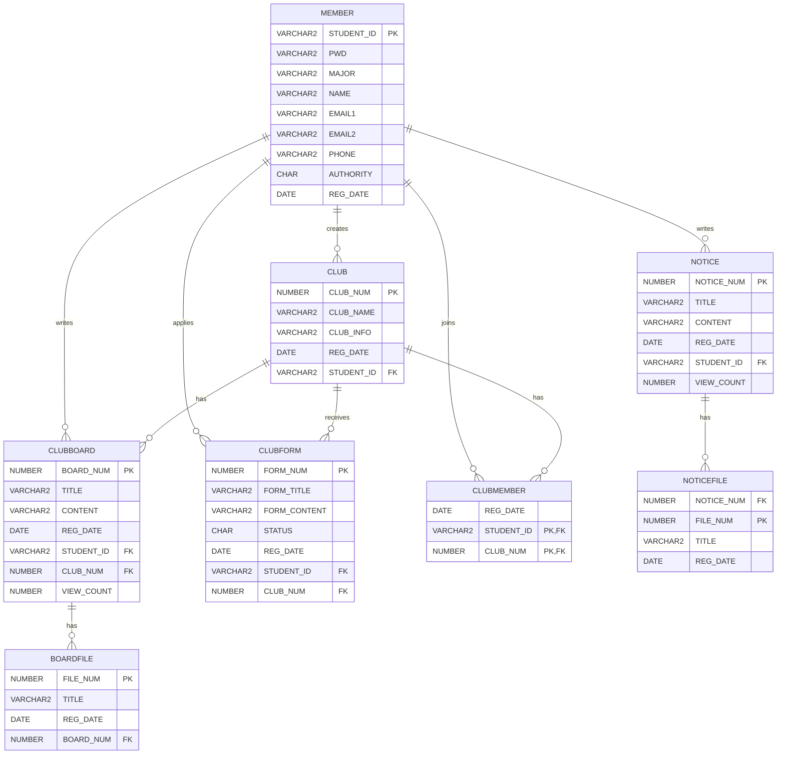

# SCHOOL CLUB

> 교내에 흩어져 있는 동아리 정보를 통합하고, 동아리 홍보부터 가입 신청 및 회원 관리까지 하나의 서비스에서 이용할 수 있도록 구현한 **교내 동아리 통합 관리 플랫폼**입니다.

학과 수업에서 JSP/Servlet으로 개발한 기존 프로젝트를 **Spring MVC로 리팩토링**하여  
기능별 Servlet 구조를 **Controller - Service - DAO 계층 구조로 개선**했습니다.

---

## 1. 프로젝트 소개

| 구분 | 내용 |
| --- | --- |
| 개발 형태 | 개인 프로젝트 |
| 담당 범위 | 기획 · DB 설계 · Backend |
| 주요 작업 | JSP/Servlet → Spring MVC 리팩토링 |
| Database | Oracle |
| Server | Apache Tomcat |

---

## 2. 기술 스택

**Backend**  
`Java` `Spring Framework` `Spring MVC` `MyBatis` `JSP/JSTL`

**Frontend**  
`HTML` `CSS` `JavaScript` `jQuery` `Ajax` `Bootstrap`

**Database**  
`Oracle`

**Tools**  
`STS` `Eclipse` `SQL Developer`

---

## 3. 주요 기능

### 회원

- 회원가입 및 로그인 / 로그아웃
- 학번 중복 확인
- 회원 정보 조회 및 수정
- 세션 기반 로그인 관리

### 동아리

- 동아리 CRUD
- 동아리 가입 신청
- 가입 신청 승인 / 거절
- 동아리 회원 관리
- 개설 및 가입 동아리 조회

### 게시판

- 공지사항 및 동아리 게시글 CRUD
- Ajax 기반 첨부파일 업로드 / 삭제
- 이미지 조회 및 일반 파일 다운로드

### 관리자

- 회원 조회 / 삭제
- 동아리 및 게시판 관리

---

## 4. ERD



---

## 5. Servlet → Spring MVC 리팩토링

### 리팩토링 배경

> 기존 JSP/Servlet 프로젝트는 기능별로 Servlet을 생성하는 구조로, 기능이 늘어나면서 Servlet의 수가 많아지고 코드 관리가 복잡해졌습니다.  
> 이를 개선하고 기능 확장과 유지보수가 용이한 구조로 변경하기 위해 Spring MVC 기반으로 리팩토링했습니다.

### 구조 변화

#### Before — JSP/Servlet

> `Servlet` → `DAO` → `DB`

<details>
<summary><b>Servlet 프로젝트 상세 구조 보기</b></summary>

```text
src
├── controller
│   ├── AdminMemberDeleteServlet.java
│   ├── AdminMemberListServlet.java
│   ├── AdminMemberReadServlet.java
│   ├── BoardDeleteServlet.java
│   ├── BoardListServlet.java
│   ├── BoardReadServlet.java
│   ├── BoardUpdateServlet.java
│   ├── BoardWriteServlet.java
│   ├── ClubCheckListServlet.java
│   ├── ClubDeleteServlet.java
│   ├── ClubFormReadServlet.java
│   ├── ClubFormWriteServlet.java
│   ├── ClubListServlet.java
│   ├── ClubMemberApproveServlet.java
│   ├── ClubMemberDeleteServlet.java
│   ├── ClubMemberReadServlet.java
│   ├── ClubMemberRejectServlet.java
│   ├── ClubReadServlet.java
│   ├── ClubRegisterServlet.java
│   ├── ClubUpdateServlet.java
│   ├── IdCheckServlet.java
│   ├── JoinServlet.java
│   ├── LoginServlet.java
│   ├── LogoutServlet.java
│   ├── MainServlet.java
│   ├── MemberReadServlet.java
│   ├── MemberUpdateServlet.java
│   ├── MyClubListServlet.java
│   ├── MyClubReadServlet.java
│   └── MyJoinClubServlet.java
│
├── dao
│   ├── ClubBoardDAO.java
│   ├── ClubDAO.java
│   └── MemberDAO.java
│
└── dto
    ├── ClubBoardVO.java
    ├── ClubFormVO.java
    ├── ClubMemberVO.java
    ├── ClubVO.java
    └── MemberVO.java

WebContent
├── admin
├── club
├── clubBoard
├── member
├── mypage
├── login.jsp
└── main.jsp
```

</details>

#### After — Spring MVC

> `Controller` → `Service / ServiceImpl` → `DAO / DAOImpl` → `MyBatis Mapper` → `DB`

<details>
<summary><b>Spring MVC 프로젝트 상세 구조 보기</b></summary>

```text
src/main/java/com/mis
├── controller
│   ├── AdminClubController.java
│   ├── AdminMemberController.java
│   ├── ClubBoardController.java
│   ├── ClubController.java
│   ├── ClubFormController.java
│   ├── ClubMemberController.java
│   ├── HomeController.java
│   ├── MemberController.java
│   ├── MypageController.java
│   ├── NoticeController.java
│   └── UploadController.java
│
├── domain
│   ├── BoardFileVO.java
│   ├── ClubBoardVO.java
│   ├── ClubFormVO.java
│   ├── ClubMemberVO.java
│   ├── ClubVO.java
│   ├── MemberVO.java
│   ├── NoticeFileVO.java
│   └── NoticeVO.java
│
├── dto
│   └── LoginDTO.java
│
├── persistence
│   ├── ClubBoardDAO.java
│   ├── ClubBoardDAOImpl.java
│   ├── ClubDAO.java
│   ├── ClubDAOImpl.java
│   ├── ClubFormDAO.java
│   ├── ClubFormDAOImpl.java
│   ├── ClubMemberDAO.java
│   ├── ClubMemberDAOImpl.java
│   ├── MemberDAO.java
│   ├── MemberDAOImpl.java
│   ├── NoticeDAO.java
│   └── NoticeDAOImpl.java
│
├── service
│   ├── ClubBoardService.java
│   ├── ClubBoardServiceImpl.java
│   ├── ClubFormService.java
│   ├── ClubFormServiceImpl.java
│   ├── ClubMemberService.java
│   ├── ClubMemberServiceImpl.java
│   ├── ClubService.java
│   ├── ClubServiceImpl.java
│   ├── MemberService.java
│   ├── MemberServiceImpl.java
│   ├── NoticeService.java
│   └── NoticeServiceImpl.java
│
└── util
    ├── MediaUtils.java
    └── UploadFileUtils.java

src/main/resources
└── mappers
    ├── clubBoardMapper.xml
    ├── clubFormMapper.xml
    ├── clubMapper.xml
    ├── clubMemberMapper.xml
    ├── memberMapper.xml
    └── noticeMapper.xml

src/main/webapp
├── resources
└── WEB-INF
    ├── classes
    ├── spring
    └── views
        ├── admin
        ├── club
        ├── clubBoard
        ├── clubForm
        ├── clubMember
        ├── include
        ├── member
        ├── mypage
        ├── notice
        ├── upload
        └── main.jsp
```

</details>

<br>

### 기능 개선

Spring MVC 리팩토링과 함께 기존 프로젝트의 기능을 확장했습니다.

#### 공지사항 기능 추가

- 공지사항 등록 / 조회 / 수정 / 삭제 기능 구현
- 첨부파일 업로드 / 삭제 기능 구현

#### 게시판 첨부파일 기능 개선

- 기존 단일 이미지 업로드 방식에서 다중 파일 업로드 방식으로 개선
- Ajax 기반 첨부파일 업로드 / 삭제 기능 구현
- 이미지뿐만 아니라 일반 파일도 첨부할 수 있도록 기능 확장

---

## 6. 리팩토링 코드 비교

### 동아리 가입 승인 / 거절

가입 승인과 거절을 각각의 Servlet에서 처리하던 구조를 Spring MVC의 계층형 구조로 리팩토링했습니다.

### Before — JSP/Servlet

기존에는 동아리 가입 승인과 거절 요청을 각각 별도의 Servlet에서 처리하고,  
Servlet에서 DAO를 직접 호출했습니다.

#### 가입 승인 Servlet

```java
@WebServlet("/clubMemberApprove.do")
public class ClubMemberApproveServlet extends HttpServlet {

    protected void doPost(HttpServletRequest request, HttpServletResponse response)
            throws ServletException, IOException {

        int formNum = Integer.parseInt(request.getParameter("formNum"));
        String studentId = request.getParameter("studentId");
        int clubNum = Integer.parseInt(request.getParameter("clubNum"));

        ClubDAO cDao = ClubDAO.getInstance();

        // 가입 신청 상태 변경
        ClubFormVO fVo = new ClubFormVO();
        fVo.setFormNum(formNum);
        cDao.approveClubMember(fVo);

        // 동아리 회원 추가
        ClubMemberVO hVo = new ClubMemberVO();
        hVo.setStudentId(studentId);
        hVo.setClubNum(clubNum);
        cDao.insertClubMember(hVo);

        response.sendRedirect("myClubRead.do?clubNum=" + clubNum);
    }
}
```

#### 가입 거절 Servlet

```java
@WebServlet("/clubMemberReject.do")
public class ClubMemberRejectServlet extends HttpServlet {

    protected void doPost(HttpServletRequest request, HttpServletResponse response)
            throws ServletException, IOException {

        int formNum = Integer.parseInt(request.getParameter("formNum"));
        int clubNum = Integer.parseInt(request.getParameter("clubNum"));

        ClubDAO cDao = ClubDAO.getInstance();

        // 가입 신청 상태 변경
        ClubFormVO fVo = new ClubFormVO();
        fVo.setFormNum(formNum);
        cDao.rejectClubMember(fVo);

        response.sendRedirect("myClubRead.do?clubNum=" + clubNum);
    }
}
```

#### DAO

```java
// 가입 승인 상태 변경
public void approveClubMember(ClubFormVO vo) {

    String sql = "UPDATE CLUBFORM SET STATUS = 2 WHERE FORMNUM = ?";

    Connection conn = null;
    PreparedStatement pstmt = null;

    try {
        conn = DBManager.getConnection();
        pstmt = conn.prepareStatement(sql);

        pstmt.setInt(1, vo.getFormNum());
        pstmt.executeUpdate();

    } catch (Exception e) {
        e.printStackTrace();
    } finally {
        DBManager.close(conn, pstmt);
    }
}

// 승인된 회원을 동아리 회원으로 추가
public void insertClubMember(ClubMemberVO vo) {

    String sql = "INSERT INTO CLUBMEMBER VALUES(SYSDATE, ?, ?)";

    Connection conn = null;
    PreparedStatement pstmt = null;

    try {
        conn = DBManager.getConnection();
        pstmt = conn.prepareStatement(sql);

        pstmt.setString(1, vo.getStudentId());
        pstmt.setInt(2, vo.getClubNum());

        pstmt.executeUpdate();

    } catch (Exception e) {
        e.printStackTrace();
    } finally {
        DBManager.close(conn, pstmt);
    }
}

// 가입 거절 상태 변경
public void rejectClubMember(ClubFormVO vo) {

    String sql = "UPDATE CLUBFORM SET STATUS = 3 WHERE FORMNUM = ?";

    Connection conn = null;
    PreparedStatement pstmt = null;

    try {
        conn = DBManager.getConnection();
        pstmt = conn.prepareStatement(sql);

        pstmt.setInt(1, vo.getFormNum());
        pstmt.executeUpdate();

    } catch (Exception e) {
        e.printStackTrace();
    } finally {
        DBManager.close(conn, pstmt);
    }
}
```

### After — Spring MVC

#### Controller

```java
// 가입 승인
@PostMapping("/approve")
public String approve(@RequestParam("formNum") int formNum, ClubMemberVO vo) throws Exception {

    formService.updateApprove(formNum, vo);

    return "redirect:/mypage/clubRead?clubNum=" + vo.getClubNum();
}

// 가입 거절
@PostMapping("/reject")
public String reject(@RequestParam("formNum") int formNum, ClubFormVO fVo) throws Exception {

    formService.updateReject(formNum);

    return "redirect:/mypage/clubRead?clubNum=" + fVo.getClubNum();
}
```

#### Service

```java
public void updateApprove(int formNum, ClubMemberVO vo) throws Exception; // 가입 승인
public void updateReject(int formNum) throws Exception; // 가입 거절
```

#### ServiceImpl

```java
@Override
public void updateApprove(int formNum, ClubMemberVO vo) throws Exception {
  dao.updateApprove(formNum); // 승인상태변경
  clubMemberDao.create(vo); // 회원테이블에 추가
}

@Override
public void updateReject(int formNum) throws Exception {
  dao.updateReject(formNum);
}
```

#### DAO

```java
public void updateApprove(int formNum) throws Exception; // 가입 승인
public void updateReject(int formNum) throws Exception; // 가입 거절
```

#### DAOImpl

```java
@Override
public void updateApprove(int formNum) throws Exception {
  session.update(namespace + ".updateApprove", formNum);
}

@Override
public void updateReject(int formNum) throws Exception {
  session.update(namespace + ".updateReject", formNum);
}
```

#### Mapper

**clubFormMapper.xml**

```xml
<update id="updateApprove">
    UPDATE CLUBFORM
    SET STATUS = 2
    WHERE FORMNUM = #{formNum}
</update>

<update id="updateReject">
    UPDATE CLUBFORM
    SET STATUS = 3
    WHERE FORMNUM = #{formNum}
</update>
```

**clubMemberMapper.xml**

```xml
<insert id="create">
    INSERT INTO CLUBMEMBER (STUDENTID, CLUBNUM, REGDATE)
    VALUES (#{studentId}, #{clubNum}, SYSDATE)
</insert>
```

### 개선 결과

- 가입 승인·거절을 각각 처리하던 Servlet을 **ClubFormController에서 통합 관리**
- Controller - Service - DAO로 역할을 분리하고 SQL을 MyBatis Mapper로 관리하도록 구조 개선

---

## 7. Troubleshooting

### 7.1 회원 삭제 시 FK 제약조건 오류

#### 문제

관리자가 회원을 삭제하는 과정에서 해당 회원이 작성한 게시글 삭제 시  
`ORA-02292` 오류가 발생했습니다.

```text
ORA-02292: integrity constraint violated
- child record found
```

#### 원인

`CLUBBOARD`의 `BOARDNUM`을 `BOARDFILE`이 FK로 참조하고 있었지만,  
회원 삭제 시 첨부파일을 삭제하지 않고 게시글을 먼저 삭제하고 있었습니다.

```text
CLUBBOARD (BOARDNUM PK)
        ↓
BOARDFILE (BOARDNUM FK)
```

따라서 `BOARDFILE`에 참조 데이터가 남아 있는 상태에서  
부모 데이터인 `CLUBBOARD`를 삭제하면서 FK 제약조건 위반이 발생했습니다.

#### 해결

회원이 작성한 게시글의 첨부파일을 먼저 삭제한 후  
게시글과 회원 데이터를 삭제하도록 순서를 변경했습니다.

```text
BOARDFILE → CLUBBOARD → MEMBER
```

`STUDENTID`를 기준으로 회원이 작성한 게시글의 `BOARDNUM`을 조회하여  
해당 게시글을 참조하는 첨부파일을 먼저 삭제했습니다.

```sql
DELETE FROM BOARDFILE
WHERE BOARDNUM IN (
    SELECT BOARDNUM
    FROM CLUBBOARD
    WHERE STUDENTID = #{studentId}
);
```

이후 게시글과 회원 데이터를 순서대로 삭제하도록 구성했습니다.

```java
// 회원이 작성한 게시글의 첨부파일 삭제
clubBoardDao.deleteMemberFile(studentId);

// 회원이 작성한 게시글 삭제
clubBoardDao.deleteMember(studentId);
```

또한 회원 삭제 과정에서 여러 테이블의 데이터가 함께 변경되므로  
`@Transactional`을 적용하여 처리 중 오류 발생 시 전체 작업이 롤백되도록 구성했습니다.

```java
@Transactional
@Override
public void delete(String studentId) throws Exception {

    clubFormDao.deleteMember(studentId);
    clubMemberDao.deleteMember(studentId);
    clubBoardDao.deleteMemberFile(studentId);
    clubBoardDao.deleteMember(studentId);
    clubDao.deleteMember(studentId);
    dao.delete(studentId);
}
```

---

### 7.2 첨부파일 원본 파일명 표시 오류

#### 문제

게시글 수정 화면에서 기존 첨부파일의 파일명 앞에  
`0_`, `b_` 등의 불필요한 문자가 포함되어 표시되는 문제가 발생했습니다.

#### 원인

첨부파일은 서버에 날짜 경로와 UUID가 포함된 형태로 저장하고 있었습니다.

```text
/2026/09/20/s_2ee174ab-872d-4d5e-a37a-333dfe4c2320_북적북적 홍보포스터.png
```

화면에 원본 파일명만 표시하기 위해 Mapper에서 고정된 위치를 기준으로  
`SUBSTR`을 사용하고 있었습니다.

```sql
SUBSTR(TITLE, 50) AS TITLE
```

이로 인해 저장 경로나 파일명 길이에 따라 문자열이 정확하게 제거되지 않는 문제가 발생했습니다.

#### 해결

고정된 위치를 기준으로 문자열을 자르는 대신,  
파일 저장 규칙을 기준으로 경로와 UUID를 제거하도록 `REGEXP_REPLACE`를 적용했습니다.

```sql
REGEXP_REPLACE(TITLE, '^.*/[sb]_[^_]+_', '') AS TITLE
```

실제 파일 경로는 `FILES`에 그대로 유지하고,  
화면에 표시되는 `TITLE`만 가공하도록 수정했습니다.

```xml
<select id="fileList" resultType="com.mis.domain.BoardFileVO">
    SELECT
        FILENUM,
        REGEXP_REPLACE(TITLE, '^.*/[sb]_[^_]+_', '') AS TITLE,
        REGDATE,
        TITLE AS FILES,
        BOARDNUM
    FROM BOARDFILE
    WHERE BOARDNUM = #{boardNum}
</select>
```

---

## 8. 시연 영상

🎥 [프로젝트 시연 영상](영상 링크)

---

## 9. 프로젝트를 통해 배운 점

JSP/Servlet으로 구현한 프로젝트를 Spring MVC로 직접 리팩토링하며  
요청 처리, 비즈니스 로직, 데이터 접근을 계층별로 분리하는 이유를 이해할 수 있었습니다.

또한 FK 제약조건 오류와 파일명 처리 문제를 해결하는 과정에서  
데이터 관계와 파일 저장 구조를 고려하여 문제의 원인을 파악하고 해결하는 경험을 쌓았습니다.
