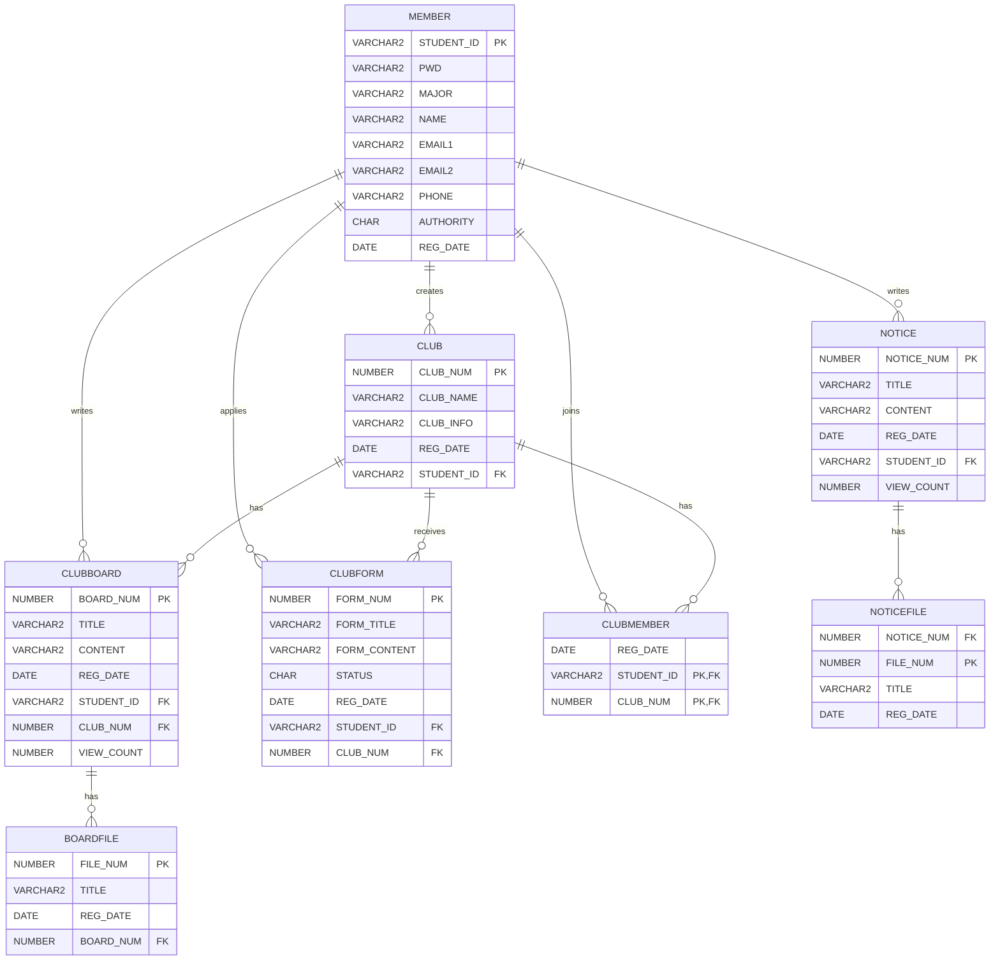

# SCHOOL CLUB

> 교내에 흩어져 있는 동아리 정보를 통합하고, 동아리 홍보부터 가입 신청 및 회원 관리까지 하나의 서비스에서 이용할 수 있도록 구현한 **교내 동아리 통합 관리 플랫폼**입니다.

학과 수업에서 JSP/Servlet으로 개발한 기존 프로젝트를 **Spring MVC로 리팩토링**하여  
기능별 Servlet 구조를 **Controller - Service - DAO 계층 구조로 개선**했습니다.

---

## 1. 프로젝트 소개

| 구분 | 내용 |
| --- | --- |
| 개발 형태 | 개인 프로젝트 |
| 담당 범위 | 기획 · DB 설계 · Backend |
| 주요 작업 | JSP/Servlet → Spring MVC 리팩토링 |
| Database | Oracle |
| Server | Apache Tomcat |

---

## 2. 기술 스택

**Backend**  
`Java` `Spring Framework` `Spring MVC` `MyBatis` `JSP/JSTL`

**Frontend**  
`HTML` `CSS` `JavaScript` `jQuery` `Ajax` `Bootstrap`

**Database**  
`Oracle`

**Tools**  
`STS` `Eclipse` `SQL Developer`

---

## 3. 주요 기능

### 회원

- 회원가입 및 로그인 / 로그아웃
- 학번 중복 확인
- 회원 정보 조회 및 수정
- 세션 기반 로그인 관리

### 동아리

- 동아리 CRUD
- 동아리 가입 신청
- 가입 신청 승인 / 거절
- 동아리 회원 관리
- 개설 및 가입 동아리 조회

### 게시판

- 공지사항 및 동아리 게시글 CRUD
- Ajax 기반 첨부파일 업로드 / 삭제
- 이미지 조회 및 일반 파일 다운로드

### 관리자

- 회원 조회 / 삭제
- 동아리 및 게시판 관리

---

## 4. ERD



---

## 5. Servlet → Spring MVC 리팩토링

### 리팩토링 배경

> 기존 JSP/Servlet 프로젝트는 기능별로 Servlet을 생성하는 구조로, 기능이 늘어나면서 Servlet의 수가 많아지고 코드 관리가 복잡해졌습니다.  
> 이를 개선하고 기능 확장과 유지보수가 용이한 구조로 변경하기 위해 Spring MVC 기반으로 리팩토링했습니다.

### 구조 변화

#### Before — JSP/Servlet

> `Servlet` → `DAO` → `DB`

<details>
<summary><b>Servlet 프로젝트 상세 구조 보기</b></summary>

```text
src
├── controller
│   ├── AdminMemberDeleteServlet.java
│   ├── AdminMemberListServlet.java
│   ├── AdminMemberReadServlet.java
│   ├── BoardDeleteServlet.java
│   ├── BoardListServlet.java
│   ├── BoardReadServlet.java
│   ├── BoardUpdateServlet.java
│   ├── BoardWriteServlet.java
│   ├── ClubCheckListServlet.java
│   ├── ClubDeleteServlet.java
│   ├── ClubFormReadServlet.java
│   ├── ClubFormWriteServlet.java
│   ├── ClubListServlet.java
│   ├── ClubMemberApproveServlet.java
│   ├── ClubMemberDeleteServlet.java
│   ├── ClubMemberReadServlet.java
│   ├── ClubMemberRejectServlet.java
│   ├── ClubReadServlet.java
│   ├── ClubRegisterServlet.java
│   ├── ClubUpdateServlet.java
│   ├── IdCheckServlet.java
│   ├── JoinServlet.java
│   ├── LoginServlet.java
│   ├── LogoutServlet.java
│   ├── MainServlet.java
│   ├── MemberReadServlet.java
│   ├── MemberUpdateServlet.java
│   ├── MyClubListServlet.java
│   ├── MyClubReadServlet.java
│   └── MyJoinClubServlet.java
│
├── dao
│   ├── ClubBoardDAO.java
│   ├── ClubDAO.java
│   └── MemberDAO.java
│
└── dto
    ├── ClubBoardVO.java
    ├── ClubFormVO.java
    ├── ClubMemberVO.java
    ├── ClubVO.java
    └── MemberVO.java

WebContent
├── admin
├── club
├── clubBoard
├── member
├── mypage
├── login.jsp
└── main.jsp
```

</details>

#### After — Spring MVC

> `Controller` → `Service / ServiceImpl` → `DAO / DAOImpl` → `MyBatis Mapper` → `DB`

<details>
<summary><b>Spring MVC 프로젝트 상세 구조 보기</b></summary>

```text
src/main/java/com/mis
├── controller
│   ├── AdminClubController.java
│   ├── AdminMemberController.java
│   ├── ClubBoardController.java
│   ├── ClubController.java
│   ├── ClubFormController.java
│   ├── ClubMemberController.java
│   ├── HomeController.java
│   ├── MemberController.java
│   ├── MypageController.java
│   ├── NoticeController.java
│   └── UploadController.java
│
├── domain
│   ├── BoardFileVO.java
│   ├── ClubBoardVO.java
│   ├── ClubFormVO.java
│   ├── ClubMemberVO.java
│   ├── ClubVO.java
│   ├── MemberVO.java
│   ├── NoticeFileVO.java
│   └── NoticeVO.java
│
├── dto
│   └── LoginDTO.java
│
├── persistence
│   ├── ClubBoardDAO.java
│   ├── ClubBoardDAOImpl.java
│   ├── ClubDAO.java
│   ├── ClubDAOImpl.java
│   ├── ClubFormDAO.java
│   ├── ClubFormDAOImpl.java
│   ├── ClubMemberDAO.java
│   ├── ClubMemberDAOImpl.java
│   ├── MemberDAO.java
│   ├── MemberDAOImpl.java
│   ├── NoticeDAO.java
│   └── NoticeDAOImpl.java
│
├── service
│   ├── ClubBoardService.java
│   ├── ClubBoardServiceImpl.java
│   ├── ClubFormService.java
│   ├── ClubFormServiceImpl.java
│   ├── ClubMemberService.java
│   ├── ClubMemberServiceImpl.java
│   ├── ClubService.java
│   ├── ClubServiceImpl.java
│   ├── MemberService.java
│   ├── MemberServiceImpl.java
│   ├── NoticeService.java
│   └── NoticeServiceImpl.java
│
└── util
    ├── MediaUtils.java
    └── UploadFileUtils.java

src/main/resources
└── mappers
    ├── clubBoardMapper.xml
    ├── clubFormMapper.xml
    ├── clubMapper.xml
    ├── clubMemberMapper.xml
    ├── memberMapper.xml
    └── noticeMapper.xml

src/main/webapp
├── resources
└── WEB-INF
    ├── classes
    ├── spring
    └── views
        ├── admin
        ├── club
        ├── clubBoard
        ├── clubForm
        ├── clubMember
        ├── include
        ├── member
        ├── mypage
        ├── notice
        ├── upload
        └── main.jsp
```

</details>

<br>

### 기능 개선

Spring MVC 리팩토링과 함께 기존 프로젝트의 기능을 확장했습니다.

#### 공지사항 기능 추가

- 공지사항 등록 / 조회 / 수정 / 삭제 기능 구현
- 첨부파일 업로드 / 삭제 기능 구현

#### 게시판 첨부파일 기능 개선

- 기존 단일 이미지 업로드 방식에서 다중 파일 업로드 방식으로 개선
- Ajax 기반 첨부파일 업로드 / 삭제 기능 구현
- 이미지뿐만 아니라 일반 파일도 첨부할 수 있도록 기능 확장

---

## 6. 리팩토링 코드 비교

> 동아리 가입 승인 / 거절 기능의 리팩토링 전후 코드

### Before — JSP/Servlet

기존에는 동아리 가입 승인과 거절 요청을 각각 별도의 Servlet에서 처리하고,  
Servlet에서 DAO를 직접 호출했습니다.

#### 가입 승인 Servlet

```java
@WebServlet("/clubMemberApprove.do")
public class ClubMemberApproveServlet extends HttpServlet {

    protected void doPost(HttpServletRequest request, HttpServletResponse response)
            throws ServletException, IOException {

        int formNum = Integer.parseInt(request.getParameter("formNum"));
        String studentId = request.getParameter("studentId");
        int clubNum = Integer.parseInt(request.getParameter("clubNum"));

        ClubDAO cDao = ClubDAO.getInstance();

        // 가입 신청 상태 변경
        ClubFormVO fVo = new ClubFormVO();
        fVo.setFormNum(formNum);
        cDao.approveClubMember(fVo);

        // 동아리 회원 추가
        ClubMemberVO hVo = new ClubMemberVO();
        hVo.setStudentId(studentId);
        hVo.setClubNum(clubNum);
        cDao.insertClubMember(hVo);

        response.sendRedirect("myClubRead.do?clubNum=" + clubNum);
    }
}
```

#### 가입 거절 Servlet

```java
@WebServlet("/clubMemberReject.do")
public class ClubMemberRejectServlet extends HttpServlet {

    protected void doPost(HttpServletRequest request, HttpServletResponse response)
            throws ServletException, IOException {

        int formNum = Integer.parseInt(request.getParameter("formNum"));
        int clubNum = Integer.parseInt(request.getParameter("clubNum"));

        ClubDAO cDao = ClubDAO.getInstance();

        // 가입 신청 상태 변경
        ClubFormVO fVo = new ClubFormVO();
        fVo.setFormNum(formNum);
        cDao.rejectClubMember(fVo);

        response.sendRedirect("myClubRead.do?clubNum=" + clubNum);
    }
}
```

#### DAO

```java
// 가입 승인 상태 변경
public void approveClubMember(ClubFormVO vo) {

    String sql = "UPDATE CLUBFORM SET STATUS = 2 WHERE FORMNUM = ?";

    Connection conn = null;
    PreparedStatement pstmt = null;

    try {
        conn = DBManager.getConnection();
        pstmt = conn.prepareStatement(sql);

        pstmt.setInt(1, vo.getFormNum());
        pstmt.executeUpdate();

    } catch (Exception e) {
        e.printStackTrace();
    } finally {
        DBManager.close(conn, pstmt);
    }
}

// 승인된 회원을 동아리 회원으로 추가
public void insertClubMember(ClubMemberVO vo) {

    String sql = "INSERT INTO CLUBMEMBER VALUES(SYSDATE, ?, ?)";

    Connection conn = null;
    PreparedStatement pstmt = null;

    try {
        conn = DBManager.getConnection();
        pstmt = conn.prepareStatement(sql);

        pstmt.setString(1, vo.getStudentId());
        pstmt.setInt(2, vo.getClubNum());

        pstmt.executeUpdate();

    } catch (Exception e) {
        e.printStackTrace();
    } finally {
        DBManager.close(conn, pstmt);
    }
}

// 가입 거절 상태 변경
public void rejectClubMember(ClubFormVO vo) {

    String sql = "UPDATE CLUBFORM SET STATUS = 3 WHERE FORMNUM = ?";

    Connection conn = null;
    PreparedStatement pstmt = null;

    try {
        conn = DBManager.getConnection();
        pstmt = conn.prepareStatement(sql);

        pstmt.setInt(1, vo.getFormNum());
        pstmt.executeUpdate();

    } catch (Exception e) {
        e.printStackTrace();
    } finally {
        DBManager.close(conn, pstmt);
    }
}
```

### After — Spring MVC

#### Controller

```java
// 가입 승인
@PostMapping("/approve")
public String approve(@RequestParam("formNum") int formNum, ClubMemberVO vo) throws Exception {

    formService.updateApprove(formNum, vo);

    return "redirect:/mypage/clubRead?clubNum=" + vo.getClubNum();
}

// 가입 거절
@PostMapping("/reject")
public String reject(@RequestParam("formNum") int formNum, ClubFormVO fVo) throws Exception {

    formService.updateReject(formNum);

    return "redirect:/mypage/clubRead?clubNum=" + fVo.getClubNum();
}
```

#### Service

```java
public void updateApprove(int formNum, ClubMemberVO vo) throws Exception; // 가입 승인
public void updateReject(int formNum) throws Exception; // 가입 거절
```

#### ServiceImpl

```java
@Override
public void updateApprove(int formNum, ClubMemberVO vo) throws Exception {
  dao.updateApprove(formNum); // 승인상태변경
  clubMemberDao.create(vo); // 회원테이블에 추가
}

@Override
public void updateReject(int formNum) throws Exception {
  dao.updateReject(formNum);
}
```

#### DAO

```java
public void updateApprove(int formNum) throws Exception; // 가입 승인
public void updateReject(int formNum) throws Exception; // 가입 거절
```

#### DAOImpl

```java
@Override
public void updateApprove(int formNum) throws Exception {
  session.update(namespace + ".updateApprove", formNum);
}

@Override
public void updateReject(int formNum) throws Exception {
  session.update(namespace + ".updateReject", formNum);
}
```

#### Mapper

**clubFormMapper.xml**

```xml
<update id="updateApprove">
    UPDATE CLUBFORM
    SET STATUS = 2
    WHERE FORMNUM = #{formNum}
</update>

<update id="updateReject">
    UPDATE CLUBFORM
    SET STATUS = 3
    WHERE FORMNUM = #{formNum}
</update>
```

**clubMemberMapper.xml**

```xml
<insert id="create">
    INSERT INTO CLUBMEMBER (STUDENTID, CLUBNUM, REGDATE)
    VALUES (#{studentId}, #{clubNum}, SYSDATE)
</insert>
```

---

## 7. 시연 영상

### 사용자

https://github.com/user-attachments/assets/d755b8b0-f7f2-4939-960a-22f2abdcd381

### 관리자

https://github.com/user-attachments/assets/67209d6c-8813-43ff-8948-a1fed5cb82f0

---

## 8. Troubleshooting

### 8.1 회원 삭제 시 FK 제약조건 오류

#### 문제

관리자가 회원을 삭제하는 과정에서 해당 회원이 작성한 게시글을 삭제할 때 `ORA-02292` 오류가 발생했습니다.

```text
ORA-02292: integrity constraint violated
- child record found
```

#### 원인

회원이 작성한 게시글을 삭제하는 로직에서 `CLUBBOARD` 데이터를 바로 삭제하고 있었습니다.

하지만 `BOARDFILE`이 `CLUBBOARD`의 `BOARDNUM`을 FK로 참조하고 있어, 게시글에 첨부파일이 존재하는 경우 참조 데이터가 남아 있는 상태에서 부모 데이터 삭제가 시도되었습니다.

```text
CLUBBOARD (BOARDNUM PK)
        ↓
BOARDFILE (BOARDNUM FK)
```

기존의 일반 게시글 삭제에서는 첨부파일을 먼저 삭제하고 게시글을 삭제했지만, 회원 삭제 로직에서는 이 과정이 누락된 것이 원인이었습니다.

#### 해결

회원 삭제 시에도 FK 관계를 고려하여 첨부파일 → 게시글 → 회원 순서로 데이터를 삭제하도록 변경했습니다.

먼저 `STUDENTID`로 회원이 작성한 게시글을 조회하고, 해당 게시글의 `BOARDNUM`을 참조하는 첨부파일을 삭제하도록 쿼리를 추가했습니다.

```sql
DELETE FROM BOARDFILE
WHERE BOARDNUM IN (
    SELECT BOARDNUM
    FROM CLUBBOARD
    WHERE STUDENTID = #{studentId}
);
```

이후 기존 게시글 삭제 로직이 실행되도록 삭제 순서를 변경했습니다.

```java
// 회원이 작성한 게시글의 첨부파일 삭제
clubBoardDao.deleteMemberFile(studentId);

// 회원이 작성한 게시글 삭제
clubBoardDao.deleteMember(studentId);
```

또한 회원 삭제는 여러 테이블의 데이터 삭제가 연속해서 수행되는 작업이므로 `@Transactional`을 적용하여  
삭제 과정에서 하나의 작업이라도 실패하면 전체 작업이 롤백되도록 하여 데이터 일관성을 유지했습니다.

```java
@Transactional
@Override
public void delete(String studentId) throws Exception {
    clubFormDao.deleteMember(studentId);
    clubMemberDao.deleteMember(studentId);
    clubBoardDao.deleteMemberFile(studentId);
    clubBoardDao.deleteMember(studentId);
    clubDao.deleteMember(studentId);
    dao.delete(studentId);
}
```

---

### 8.2 첨부파일 원본 파일명 표시 오류

#### 문제

게시글 수정 화면에서 기존 첨부파일의 원본 파일명 앞에 `0_`, `b_` 등의 불필요한 문자가 함께 표시되는 문제가 발생했습니다.

#### 원인

업로드한 파일은 서버에 저장될 때 날짜 경로와 UUID가 포함된 형태로 저장됩니다.

```text
/2026/09/20/s_2ee174ab-872d-4d5e-a37a-333dfe4c2320_북적북적 홍보포스터.png
```

수정 화면에서는 사용자에게 원본 파일명만 보여주기 위해 Mapper에서 `SUBSTR`을 사용하여 앞부분을 제거하고 있었습니다.

```sql
SUBSTR(TITLE, 50) AS TITLE
```

하지만 문자열의 고정된 위치를 기준으로 파일명을 잘라내는 방식이었기 때문에 저장 경로나 파일명에 따라 일부 문자가 함께 남는 문제가 발생했습니다.

#### 해결

고정된 위치를 기준으로 문자열을 자르는 대신, 파일 저장 형식을 기준으로 경로와 UUID를 제거하도록 `REGEXP_REPLACE`를 사용했습니다.

```sql
REGEXP_REPLACE(TITLE, '^.*/[sb]_[^_]+_', '') AS TITLE
```

DB에 저장된 실제 파일 경로는 파일 조회와 삭제에 사용해야 하므로 `FILES`에 그대로 유지하고, 화면에 출력되는 `TITLE`만 원본 파일명으로 가공했습니다.

```xml
<select id="fileList" resultType="com.mis.domain.BoardFileVO">
    SELECT
        FILENUM,
        REGEXP_REPLACE(TITLE, '^.*/[sb]_[^_]+_', '') AS TITLE,
        REGDATE,
        TITLE AS FILES,
        BOARDNUM
    FROM BOARDFILE
    WHERE BOARDNUM = #{boardNum}
</select>
```

---

## 9. 프로젝트를 통해 배운 점

기존 JSP/Servlet 프로젝트를 Spring MVC로 직접 리팩토링하며, 단순히 프레임워크를 사용하는 것을 넘어 **계층을 분리하는 이유와 각 계층의 역할**을 이해할 수 있었습니다.

기존 프로젝트에서는 기능별로 Servlet을 생성하고, 각 Servlet에서 요청 파라미터 처리와 DAO 호출, 화면 이동을 담당했습니다. 기능이 추가되면서 Servlet의 수도 함께 증가했고, 이를 Spring MVC로 전환하면서 관련 요청은 Controller에서 관리하고, 비즈니스 로직은 Service, 데이터 접근은 DAO, SQL은 MyBatis Mapper로 분리했습니다. 이 과정을 통해 **기능 확장과 유지보수를 고려하여 각 계층의 역할을 분리하는 것이 중요하다는 점**을 배웠습니다.

또한 기존 기능을 그대로 옮기는 데 그치지 않고 공지사항 기능을 추가하고, 단일 이미지 업로드 방식을 Ajax 기반 다중 파일 업로드 방식으로 개선하며 **기존 구조에 새로운 기능을 확장하는 경험**을 할 수 있었습니다.

개발 과정에서 발생한 FK 제약조건 오류를 해결하며 테이블 간 관계와 데이터 삭제 순서의 중요성을 확인했고, 여러 데이터 변경이 하나의 작업으로 처리되는 경우 **트랜잭션을 통해 데이터 일관성을 보장해야 한다는 점**을 배웠습니다.

첨부파일의 원본 파일명이 정상적으로 표시되지 않는 문제를 해결하는 과정에서는 화면에 보이는 결과만 확인하는 것이 아니라, **파일의 저장 규칙과 DB에 저장된 데이터를 함께 추적하여 문제의 원인을 파악하는 경험**을 했습니다.

이번 프로젝트를 통해 기능 구현에 그치지 않고, **코드와 데이터의 흐름을 이해하여 문제의 원인을 파악하고 유지보수와 기능 확장을 고려해 구조를 설계하는 관점**을 익힐 수 있었습니다.
